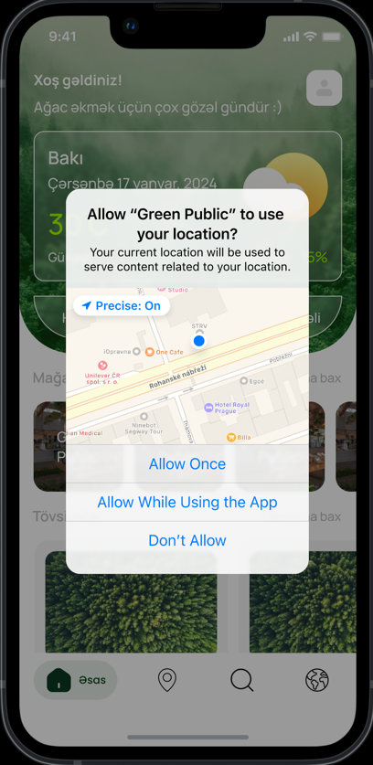
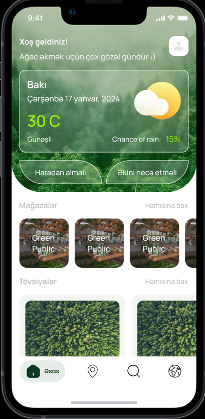

# GreenPublic Open Source Project

Location Permission |  Main Page
:-------------------------:|:-------------------------:
   |  

This repository contains the backend code for the GreenPublic application, which aims to promote green initiatives, tree planting, and environmental awareness. The application is developed using Spring Boot with MongoDB as the database.

## Project Structure

The project is organized into multiple phases to facilitate incremental development. Each phase focuses on specific functionalities. The project structure is as follows:

# Phase #1: **Tree Suggestions, Tree Information, Retail Stores**
    - Controllers:
        - SoilTypeController
        - WateringFrequencyController
        - SuggestionsController
        - RetailStoreController
        - InformationController
        - LanguageController
        - TreeController
        - TreeSpeciesController
    - Models:
        - SoilTypeDto
        - WateringFrequency
        - SuggestionsDto
        - RetailStoreDto
        - Information
        - LanguageDto
        - TreeDto
        - TreeSpeciesDto

# **Phase #2: Tree Donations System**
    - Introduce functionalities related to tree donations.
    - Additional controllers, models, and services specific to tree donations.

# **Phase #3: Tree Planters Community**
    - Develop features for a community of tree planters.
    - Include controllers, models, and services for community-related activities.

## Figma Design

The [Figma link](https://www.figma.com/proto/IPD5F2CVZ9Qs6ssrorMrrx/Greenpublic---Main?page-id=2036%3A641&type=design&node-id=2036-1583&viewport=2013%2C757%2C0.53&t=zaEodd5sL9oModMk-1&scaling=scale-down&mode=design) provides a visual representation of the application design and user interface.

## RapidAPI Documentation

The comprehensive API documentation, including details about controllers, endpoints, and request/response structures, is available on [RapidAPI](https://rapidapi.com/greenpubliccommunity/api/green-public).

## Getting Started

Follow these steps to set up and run the GreenPublic backend:

1. Clone the repository:

    ```bash
    git clone https://github.com/greenPublic/green-public-backend.git
    cd greenpublic-backend
    ```

2. Install dependencies and build the project:

    ```bash
    mvn clean install
    ```

3. Configure MongoDB:

    - Set up a MongoDB instance and update the connection details in the `application.properties` file.

4. Run the application:

    ```bash
    mvn spring-boot:run
    ```

5. The application will be accessible at `https://greenpublic-a9164562b31a.herokuapp.com`.

## Contributing

Contributions to the GreenPublic backend are welcome. Follow these steps to contribute:

1. Fork the repository.
2. Create a new branch for your feature: `git checkout -b feature-name`.
3. Commit your changes: `git commit -m 'Add feature'`.
4. Push to the branch: `git push origin feature-name`.
5. Create a pull request.

## License

This project is licensed under the [MIT License](LICENSE). Feel free to use, modify, and distribute it.